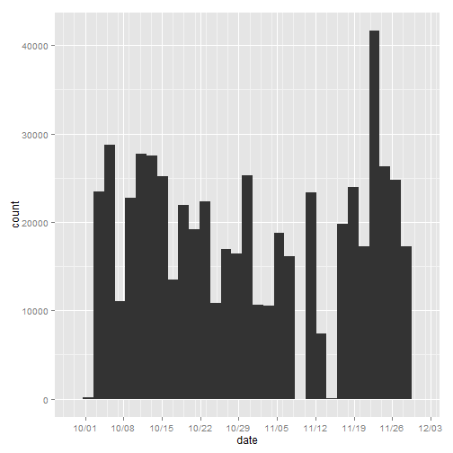
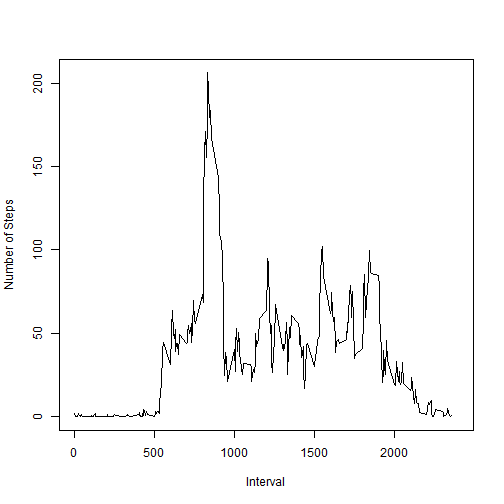
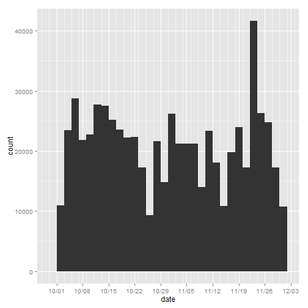
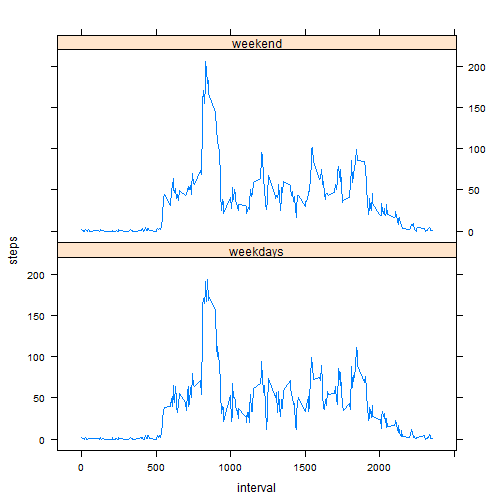

PeerAssignment 1 
========================================================
 1) set the working directory 
 2) Read the i/p file into a file named activity
 3) Remove all "NA"
 4) split the source file based on dates using tapply function
 5) Find the number of levels ie 
 6) Find the total number of steps for each of the date  using for loop
 7) Display the total steps taken per day as a histogram using ggplot2

## Loading and preprocessing the data

 1) Code for Loading the data


```r
setwd("C:/Users/venkat rao/Documents/Coursera/RR")
activity <- read.csv("activity.csv", stringsAsFactors = FALSE)
```


 2)Code for preprocessing: Removing NA for analysis


```r
histactivity <- na.omit(activity)
```

## What is mean total number of steps taken per day?

 Applying tapply to find total steps per day 


```r
splitsum <- tapply(histactivity$steps, histactivity$date, sum, simplify = FALSE)
histactivity$date <- as.factor(histactivity$date)
index <- length(levels(histactivity$date))


for (i in 1:index) {
    if (i == 1) {
        steps <- splitsum[[i]]
        date <- dimnames(splitsum)[[1]][i]
        Totalstepsperday <- data.frame(date, steps)
    } else 
    {
        steps <- splitsum[[i]]
        date <- dimnames(splitsum)[[1]][i]
        Totalstepsperday1 <- data.frame(date, steps)
        Totalstepsperday <- rbind(Totalstepsperday, Totalstepsperday1)
    }
}

library(ggplot2)
library(scales)
```

```
## Warning: package 'scales' was built under R version 3.0.3
```

  1) Make a histogram of the total number of steps taken each day

  Histogram of Total no:of steps vs Date


```r
Totalstepsperday$date <- as.Date(Totalstepsperday$date)
m <- ggplot(Totalstepsperday, aes(x = date))
m + geom_histogram(aes(weight = steps)) + scale_x_date(breaks = "1 weeks", minor_breaks = "2 day", 
    labels = date_format("%m/%d"))
```

```
## stat_bin: binwidth defaulted to range/30. Use 'binwidth = x' to adjust this.
```

 

  2) Calculate and report the mean and median total number of steps taken per day 


     Median number of steps is  10765 & Mean number of steps  is   10766.
     
## What is the average daily activity pattern?
     
 1) Make a time series plot (i.e. type = "l") of the 5-minute interval (x-axis) and the average number of steps taken, averaged  across all days (y-axis)
    1a) Apply tapply to find  average number of steps across each interval
    1b) Create a dataframe Averagesteps 
    

```r
splitinterval <- tapply(histactivity$steps, histactivity$interval, mean, simplify = FALSE)
histactivity1 <- histactivity
histactivity1$interval <- as.factor(histactivity1$interval)
index <- length(levels(histactivity1$interval))
for (i in 1:index) {
    if (i == 1) {
        steps <- splitinterval[[i]]
        interval <- as.numeric(dimnames(splitinterval)[[1]][i])
        Averagesteps <- data.frame(interval, steps)
    } else {
        steps <- splitinterval[[i]]
        interval <- as.numeric(dimnames(splitinterval)[[1]][i])
        Averagesteps1 <- data.frame(interval, steps)
        Averagesteps <- rbind(Averagesteps, Averagesteps1)
    }
}

plot(Averagesteps$interval, Averagesteps$steps, type = "l", xlab = "Interval", 
    ylab = "Number of Steps", xlim = c(0, 2400))
```

 

    
    
  
2) Which 5-minute interval, on average across all the days in the dataset, contains the maximum number of steps?


      The 5 minute interval having Avergae maimum number of steps is  835.
##  Imputing missing values

   1) The total number of missing values in the dataset (i.e. the total number of rows with NAs) is 2304, 0, 0

   2) Filled the missing values with mean of steps across each interval.  
   
   3) Dataset activityna created which is filled with missing values .These values are the mean of the days per interval..

   
   

```
## Warning: package 'gam' was built under R version 3.0.3
```

```
## Loading required package: splines
## Loaded gam 1.09
## 
## stat_bin: binwidth defaulted to range/30. Use 'binwidth = x' to adjust this.
```

 


The mean and median total number of steps taken per day is  10766 & 10766.1887

Values dont differ much from the estimates from the first part of the assignment?  

Impact according to my computations is minimal

## Are there differences in activity patterns between weekdays and weekends?

        Based on the plots below we can see there is not much of a difference between both the plots

1) Create a new factor variable in the dataset with two levels - "weekday" and "weekend" indicating whether a given date is a weekday or weekend day.
    Created ..

2) Make a panel plot containing a time series plot (i.e. type = "l") of the 5-minute interval (x-axis) and the average number of steps taken, averaged across all weekday days or weekend days (y-axis). 


```
## Warning: package 'lattice' was built under R version 3.0.3
```

 

     
